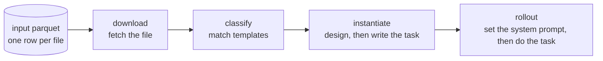

# file-manipulation-pipeline

A reference implementation of the pipeline we used to create realistic office tasks around real files and to record agents carrying them out. It starts from office files (PDF, Word, Excel, PowerPoint) found in public GitHub repositories. For each file it picks the task patterns the file could serve, has an agent design and write a task grounded in that file, and then has another agent do the task in a sandbox while its trace is recorded.

The code is published so others can see how the pieces fit together. It depends on our worker VMs, an OpenAI-compatible model endpoint and a patched agent CLI, so it won't run elsewhere without changes; [docs/operations.md](docs/operations.md) describes the setup we used.

## Pipeline



| Step | What it does | Details |
|---|---|---|
| download | An agent fetches one file from its URL, or marks it as unusable. | [docs/stages/download.md](docs/stages/download.md) |
| classify | An agent reads the file and assigns it zero or more of 57 task templates. | [docs/stages/classify.md](docs/stages/classify.md) |
| instantiate | For each (file, template) pair, one agent defines the ways a task could vary and a sampler picks one; a second agent writes the task: an email-style request, reference files, a rubric and the shape of the deliverable. | [docs/stages/instantiate.md](docs/stages/instantiate.md) |
| rollout | One agent rewrites the agent harness's system prompt in a randomly drawn style; a second agent then does the task in a sandbox with that prompt. | [docs/stages/rollout.md](docs/stages/rollout.md) |

## How it runs

A coordinator works out which items are ready for each step by scanning a shared folder tree, and hands them out over HTTP. Worker VMs run many concurrent loops that claim an item, pull its inputs over rsync, run an agent, check what it wrote, and push the result back into the tree. Each agent is the forge CLI running inside the cowbox sandbox. Any OpenAI-compatible model endpoint can serve the agents. See [docs/architecture.md](docs/architecture.md) and [docs/operations.md](docs/operations.md).

## Where diversity comes from

- **Balanced queue:** the instantiate queue is interleaved across (template, file type) pairs, so common templates and PDFs don't crowd out the rest.
- **Design-space sampling:** the design agent lists the ways a task around the file could vary; `cast.py` checks the space is large enough and picks one combination from the task hash, so the agent doesn't choose its own.
- **Posture draw:** before a rollout, an agent writes several styles of system prompt and `draw.py` picks one at random.

See [docs/diversity.md](docs/diversity.md).

## Templates and manifolds

57 metatemplates in 11 categories describe patterns of professional office work, and two manifold documents describe how real work and real task materials vary. The taxonomy and metatemplates were derived from the public GDPval tasks; the released templates omit per-task sample IDs and task-level examples. The manifold documents summarize population-level observations. See [docs/metatemplates.md](docs/metatemplates.md).

## Repository layout

```
pipeline-coordinator/     coordinator: claim API, artifact-tree scans, rsync daemon, SSH tunnels
office-files-pipeline/    worker: the four step cycles, prompts, templates, manifolds, configs
scripts/remote_launch.sh  worker VM bootstrap and launch
examples/                 sample input rows and one file followed through every step
docs/                     how each part works; start at docs/index.md
```

## Not included

- Converting recorded traces into training data.
- Mining the list of input files from GitHub.
- Launch scripts for the coordinator host, the model servers and the worker fleet.

## License

Apache-2.0; see [LICENSE](LICENSE).
